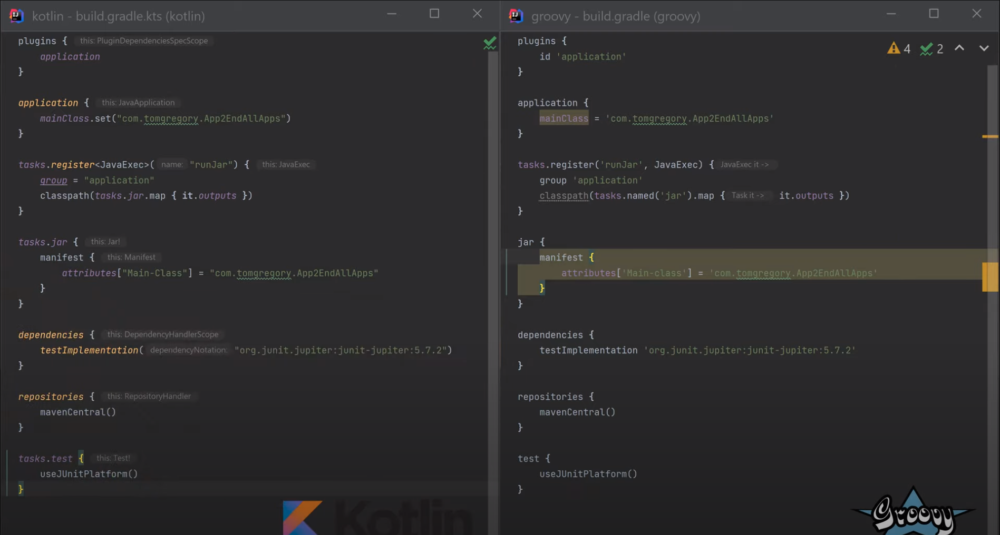

# Kotlin - Apprentissage 

## Sommaire

- [1 - Qu'est-ce que Kotlin ?](#1)
	- [1.1 - Apprentissage](#1-1)
		- [1.1.1 - Formation au format text](#1-1-1)
		- [1.1.2 - Formation au format vidéo](#1-1-2)
	- [1.2 - Configuration et dépendances via Gradle](#1-2)
		- [1.2.1 - Gradle Groovy ou Gradle Kotlin avec DSL ?](#1-2-1)
		- [1.2.2 - Donc,](#1-2-2)
		- [1.2.3 - Comparaison des codes Gradle Groovy ou Gradle Kotlin DSL](#1-2-3)
- [2 - Projets](#2)
	- [2.1 - Projets de démonstration](#2-1)

## 1 - Qu'est-ce que Kotlin ? - [Haut de page](#top) 

- [KOTLIN VS JAVA - Quel langage pour débuter le développement Android ?](https://www.youtube.com/watch?v=Vw7YmpZMW10)

### 1.1 - Apprentissage - [Haut de page](#top) 

#### 1.1.1 - Formation au format text - [Haut de page](#top) 

- [kotlinlang.org](https://kotlinlang.org)
	- [Getting Started](https://kotlinlang.org/docs/getting-started.html)
	- [Get started with Kotlin/JVM](https://kotlinlang.org/docs/jvm-get-started.html)
- [Learn Kotlin by Example](https://play.kotlinlang.org/byExample/overview)

#### 1.1.2 - Formation au format vidéo - [Haut de page](#top) 

- [Kotlin pour débutants: les bases pour débuter dans le mobile sous Android](https://www.youtube.com/playlist?list=PLhK6H-zs_Wy34nIAiL853S4pxmwI9mObW)
- [Grafikart Live - Apprentissage de Kotlin/Android](https://www.youtube.com/playlist?list=PLBgE6RNLJNqTx1FzHUC4xHs1qPKBbzw9w)

### 1.2 - Configuration et dépendances via Gradle - [Haut de page](#top) 

Sources : 
	- 
	- [Gradle Kotlin vs. Groovy DSL (side-by-side comparison)](https://www.youtube.com/watch?v=ErdH9mQySQQ)

#### 1.2.1 - Gradle Groovy ou Gradle Kotlin avec DSL ? - [Haut de page](#top) 

Gradle prend en charge le langage spécifique au domaine Groovy et Kotlin pour décrire les builds. 

- Un script de construction Gradle de type Groovy peut contenir tout élément de langage Groovy. 
- Un script de construction Gradle de type Kotlin peut contenir n'importe quel élément de langage Kotlin, sachant que Kotlin es DSL.

> **NB** :
> Qu'est-ce qu'un DSL ?
> 
> DSL est un acronyme pour Domain Specific Language (langage spécifique au domaine) qui peut être utilisé dans le contexte d'un domaine particulier. Il s'agit d'un contraste avec le langage à usage général (GPL) comme Java qui est largement applicable ou utilisé pour de multiples domaines. Il nous aide à écrire du code déclaratif afin de réduire les éléments passe-partout. Le code écrit avec un DSL sera beaucoup plus facile à lire.
> 
> L'usage courant du langage DSL est HTML dans le développement Web, Gradle dans les outils de construction, SQL dans la gestion des données, XML pour le langage de balisage, etc. Bien que nous ayons de l'expérience dans un ou plusieurs des langages mentionnés ci-dessus, nous ne savons peut-être pas que nous utilisons un DSL.

#### 1.2.2 - Donc, - [Haut de page](#top) 

_Le DSL Kotlin de Gradle fournit une syntaxe alternative au DSL Groovy traditionnel avec une expérience d'édition améliorée dans les IDEs supportés, avec une assistance au contenu, un refactoring, une documentation et plus encore - **Gradle Team**_

Nous pouvons avoir quelques avantages à choisir le DSL Kotlin plutôt que Groovy :

- Bonne lisibilité
- Syntaxe Kotlin facilement adaptable à partir du langage parent.
- Navigation dans le code et suggestions automatiques
- Erreurs en temps de compilation
- Supporte actuellement des accesseurs de modèle sûrs pour les configurations de dépendances et d'artefacts, les ensembles de sources, etc.
- Mais cela peut être un peu plus lent dans certaines situations comme le nettoyage, les changements liés au répertoire buildSrc, etc.

#### 1.2.3 - Comparaison de codes Gradle Groovy ou Gradle Kotlin DSL - [Haut de page](#top) 

Image de Comparaison de codes Gradle Groovy ou Gradle Kotlin DSL ci-dessus.

## 2 - Projets - [Haut de page](#top) 

### 2.1 - Projets de démonstration - [Haut de page](#top) 

- App - 1 - Menu - USSD : [/App_1_Menu_USSD](/App_1_Menu_USSD)